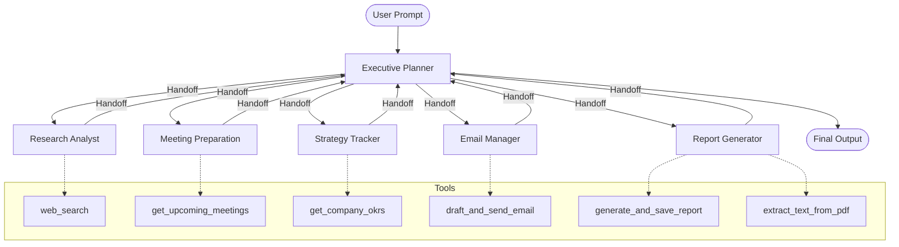

# Multi-Agent Design & Architecture

## 1. Agent Architecture Diagram

## 2. Roles of Each Agent
1. **Executive Planner**: The central orchestrator. It acts as the routing layer, breaking down the user's initial prompt into sub-tasks and delegating them to the appropriate specialist agents. It maintains the overall context of the goal.
2. **Research Analyst**: Responsible for fetching up-to-date facts from the internet. When asked about a specific topic, it runs web searches to compile data.
3. **Meeting Preparation**: Responsible for retrieving calendar events and meeting schedules to prepare the executive for the day ahead.
4. **Strategy Tracker**: Responsible for monitoring high-level company goals and OKRs, providing strategic alignment context to the rest of the team.
5. **Email Manager**: Responsible for drafting outbound communications based on the findings of the other agents. Crucially, it stops execution to ask for human approval before sending.
6. **Report Generator**: Responsible for synthesizing the gathered context into a final structured output, saving it as a clean markdown file.

## 3. Agent Interaction and Handoff Flow
The system operates on a **Hub-and-Spoke** model. The `Executive Planner` sits at the hub. 
When the user issues a command, the Planner processes it and decides which agent should act first. It uses a `transfer_to_<agent>` tool to pass the execution context (the multi-turn message history) to that agent. 
Once the specialized agent completes its subtask (e.g., executing a web search or drafting an email), it uses the `transfer_to_planner` tool to return control back to the hub. This cycle continues until the Planner determines all objectives are fulfilled, at which point it delivers the final summary to the user.

## 4. Tool Integration Overview
- **web_search** (`tools/search.py`): Integrates with `duckduckgo_search` to perform real-time internet queries.
- **get_upcoming_meetings** (`tools/calendar.py`): Fetches calendar events (mocked) for specific dates.
- **get_company_okrs** (`tools/strategy.py`): Fetches the current quarterly OKRs from memory.
- **draft_and_send_email** (`tools/gmail.py`): Drafts an email and uses Python's `input()` to prompt the terminal for a `y/n` human approval before confirming the action.
- **generate_and_save_report** (`tools/docs.py`): Uses Pydantic structured output models (`ExecutiveSummary`) to enforce JSON conformity, and saves the output to a local `.md` file.
- **global_memory** (`memory/memory.py`): A cross-agent Key-Value store that persists state during the session, allowing agents to share data without polluting the LLM context window.
